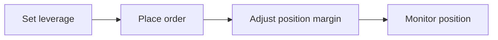

## Overview

This guide walks through the full lifecycle of using Isolated Margin via the API. Both Cross and Isolated margin modes are supported simultaneously — you can hold a Cross position and an Isolated position on the same symbol at the same time. Simply specify `margin_mode` when placing an order. For a conceptual overview, see [Isolated Margin basics](/introduction/trade-on-orderly/perpetual-futures/isolated-margin).



## Step 1: Set Leverage for Isolated Mode

Each symbol maintains independent leverage settings per margin mode. Set the leverage for the Isolated mode specifically.

**API:** [POST `/v1/client/leverages`](/build-on-omnichain/restful-api/private/update-leverage-setting)

**Request body (single symbol):**

```json
{
  "symbol": "PERP_ETH_USDC",
  "leverage": 10,
  "margin_mode": "ISOLATED"
}
```

You can also query the current leverage:

**API:** [GET `/v1/client/leverage`](/build-on-omnichain/restful-api/private/get-leverage-setting) with query params `symbol=PERP_ETH_USDC&margin_mode=ISOLATED`

<Note>
  The leverage you set in Isolated mode determines how much margin is allocated from your available balance when opening a position. Higher leverage = less margin allocated = tighter liquidation price.
</Note>

### Batch Leverage Updates

When using [POST `/v1/client/leverages`](/build-on-omnichain/restful-api/private/update-leverage-setting) without a `symbol` parameter, the behavior differs by mode:

| Mode | Behavior |
| --- | --- |
| **Cross** | All cross-margin symbols update atomically — all succeed or none do |
| **Isolated** | Only applies to symbols with no active isolated positions or pending orders; eligible symbols always update |

## Step 2: Place an Order

Place an order specifying the `margin_mode` parameter.

**API:** [POST `/v1/order`](/build-on-omnichain/restful-api/private/create-order)

**Request body:**

```json
{
  "symbol": "PERP_ETH_USDC",
  "order_type": "LIMIT",
  "side": "BUY",
  "order_price": 2500,
  "order_quantity": 1,
  "margin_mode": "ISOLATED"
}
```

If `margin_mode` is omitted, the symbol's default margin mode is used. You can change the default display mode via [POST `/v1/client/margin_mode`](/build-on-omnichain/restful-api/private/update-margin-mode) -- this is primarily for frontend display purposes and does not restrict which mode you can trade in.

## Step 3: Adjust Position Margin

After opening an Isolated position, you can add or reduce the margin allocated to it.

**API:** [POST `/v1/position_margin`](/build-on-omnichain/restful-api/private/add-reduce-position-margin)

**Add margin** (lowers liquidation price, reduces risk):

```json
{
  "symbol": "PERP_ETH_USDC",
  "amount": "100",
  "type": "ADD"
}
```

**Reduce margin** (raises liquidation price, frees up balance):

```json
{
  "symbol": "PERP_ETH_USDC",
  "amount": "50",
  "type": "REDUCE"
}
```

| Type | Effect |
| --- | --- |
| `ADD` | Transfers margin from available balance to the isolated position |
| `REDUCE` | Transfers margin from the isolated position back to available balance |

## Step 4: Monitor Position

Query the position with the `margin_mode` parameter to get isolated-specific data.

**API:** [GET `/v1/position/{symbol}`](/build-on-omnichain/restful-api/private/get-one-position-info) with query param `margin_mode=ISOLATED`

Key fields in the response:

| Field | Description |
| --- | --- |
| `margin` | Amount of margin allocated to this isolated position |
| `margin_mode` | `ISOLATED` |
| `leverage` | Current leverage for this position |
| `est_liq_price` | Estimated liquidation price |
| `position_qty` | Position size |
| `unsettled_pnl` | Current unsettled PnL |
| `imr` | Initial margin ratio |
| `mmr` | Maintenance margin ratio |

### WebSocket Updates

Subscribe to the private `position` topic to receive real-time updates for position changes including margin, PnL, and liquidation price. See [WebSocket API](/build-on-omnichain/websocket-api/private/account) for details.

### Account Balance

The [GET `/v1/client/aggregate/holding`](/build-on-omnichain/restful-api/private/get-aggregate-holding) endpoint includes two isolated-margin-specific fields:

| Field | Description |
| --- | --- |
| `isolated_margin` | Total margin currently allocated to all isolated positions |
| `isolated_order_frozen` | Margin frozen in pending isolated orders |

## Liquidation Behavior

When an Isolated position is liquidated:

- Only the margin assigned to that position is lost
- Other positions (Cross or Isolated) and your account balance are **unaffected**
- The position is handled independently by the liquidation engine

For full details, see [Liquidations](/introduction/trade-on-orderly/perpetual-futures/liquidations).

## Related Pages

- [Isolated Margin basics](/introduction/trade-on-orderly/perpetual-futures/isolated-margin) — conceptual overview and comparison with Cross Margin
- [Margin, Leverage & PnL](/introduction/trade-on-orderly/perpetual-futures/margin-leverage-and-pnl) — margin ratios, leverage tiers, and PnL calculations
- [Order Management](/build-on-omnichain/user-flows/order-management) — order lifecycle and API reference
- [Liquidations](/introduction/trade-on-orderly/perpetual-futures/liquidations) — liquidation process and tiers
