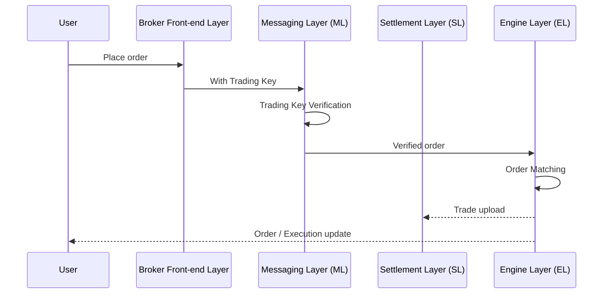

## Order Lifecycle

When a user places an order, it flows through Orderly's layered architecture:

1. The **Broker Front-end Layer** forwards the request with the user's Trading Key
2. The **Messaging Layer** verifies the Trading Key
3. The **Engine Layer** matches the order against the order book
4. On execution, trade data is uploaded to the **Settlement Layer**
5. The user receives order and execution updates

## API Reference

Orders are managed through the following APIs:

- **Create order:** [POST `/v1/order`](/build-on-omnichain/restful-api/private/create-order)
- **Batch create orders:** [POST `/v1/batch-order`](/build-on-omnichain/restful-api/private/batch-create-order)
- **Edit order:** [PUT `/v1/order`](/build-on-omnichain/restful-api/private/edit-order)
- **Cancel order:** [DELETE `/v1/order`](/build-on-omnichain/restful-api/private/cancel-order)
- **Cancel all orders:** [DELETE `/v1/orders`](/build-on-omnichain/restful-api/private/cancel-all-pending-orders)
- **Get order:** [GET `/v1/order/{oid}`](/build-on-omnichain/restful-api/private/get-order-by-order_id)
- **Get orders:** [GET `/v1/orders`](/build-on-omnichain/restful-api/private/get-orders)

For algo orders (STOP, TP/SL, BRACKET), see [Algo Order Samples](/build-on-omnichain/user-flows/algo-order-samples).
