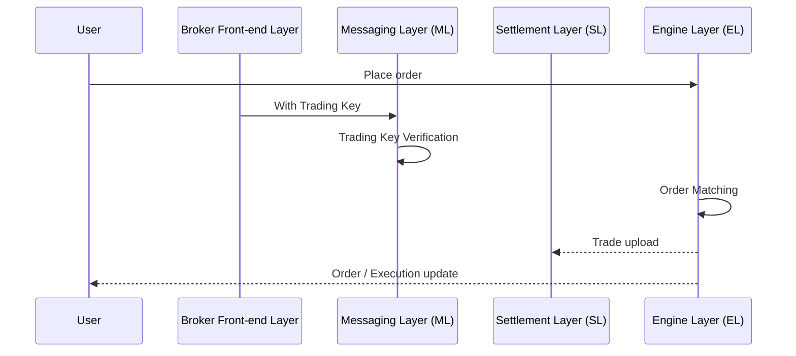

```mermaid
sequenceDiagram
    participant U as User
    participant BF as Broker Front-end Layer
    participant ML as Messaging Layer (ML)
    participant SL as Settlement Layer (SL)
    participant EL as Engine Layer (EL)

    %% User places order
    U->>EL: Place order

    %% Order routed through layers

    %% Trading key handling
    BF->>ML: With Trading Key
    ML->>ML: Trading Key Verification

    %% Matching engine
    EL->>EL: Order Matching

    %% Trade result
    EL-->>SL: Trade upload

    %% Execution update broadcast
    EL-->>U: Order / Execution update
```
