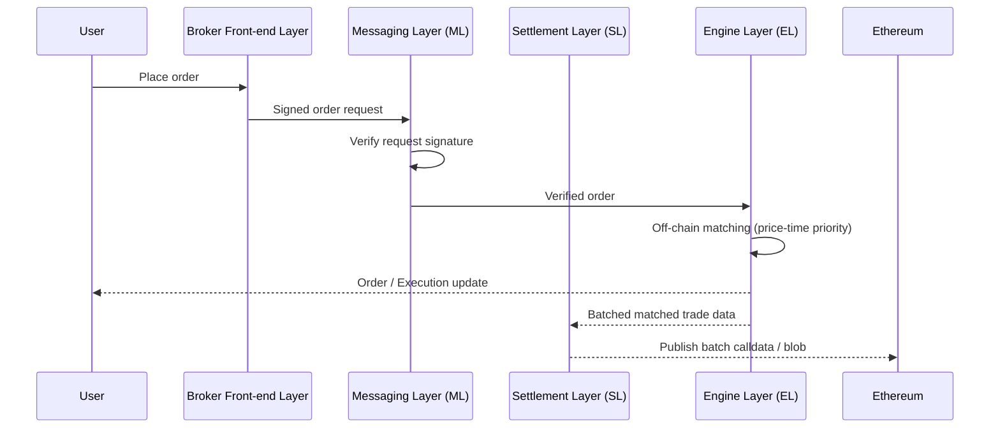

## Order Lifecycle

When a user places an order, it flows through Orderly's layered architecture:

1. The **Broker Front-end Layer** forwards the signed order request
2. The **Messaging Layer** verifies the request signature
3. The **Engine Layer** matches the order off-chain using price-time priority
4. The user receives order and execution updates
5. On execution, matched trade data is batched and uploaded to the **Settlement Layer**
6. After L2 inclusion, the matched trade data is publicly observable on Orderly L2
7. Each L2 batch or block publishes its batch data to Ethereum as calldata or
   blob data, which becomes observable after the L1 publication is available

```mermaid
sequenceDiagram
    participant U as User
    participant BF as Broker Front-end Layer
    participant ML as Messaging Layer (ML)
    participant SL as Settlement Layer (SL)
    participant EL as Engine Layer (EL)
    participant ETH as Ethereum

    %% User places order
    U->>BF: Place order

    %% Trading Key handling
    BF->>ML: Signed order request
    ML->>ML: Verify request signature

    %% Forward to engine
    ML->>EL: Verified order

    %% Matching engine
    EL->>EL: Off-chain matching (price-time priority)

    %% Execution update broadcast
    EL-->>U: Order / Execution update

    %% Trade result
    EL-->>SL: Batched matched trade data

    %% L2 data publication
    SL-->>ETH: Publish batch calldata / blob
```

For the visibility and MEV boundaries at each stage, see [Orderly Orderbook Design](/introduction/trade-on-orderly/trading-basics/orderbook-design).

## API Reference

Orders are managed through the following APIs:

- **Create order:** [POST `/v1/order`](/build-on-omnichain/restful-api/private/create-order)
- **Batch create orders:** [POST `/v1/batch-order`](/build-on-omnichain/restful-api/private/batch-create-order)
  batches client order submissions; it is separate from post-match settlement
  batching.
- **Edit order:** [PUT `/v1/order`](/build-on-omnichain/restful-api/private/edit-order)
- **Cancel order:** [DELETE `/v1/order`](/build-on-omnichain/restful-api/private/cancel-order)
- **Cancel all orders:** [DELETE `/v1/orders`](/build-on-omnichain/restful-api/private/cancel-all-pending-orders)
- **Get order:** [GET `/v1/order/{oid}`](/build-on-omnichain/restful-api/private/get-order-by-order_id)
- **Get orders:** [GET `/v1/orders`](/build-on-omnichain/restful-api/private/get-orders)

For algo orders (STOP, TP/SL, BRACKET), see [Algo Order Samples](/build-on-omnichain/user-flows/algo-order-samples).
