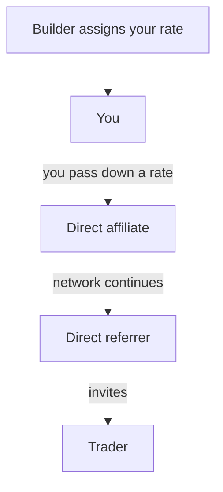

## 1. What the program lets you do

The Orderly DEX Affiliate Program lets you earn commission from traders in your referral network. You can earn from:

- **Direct referrals:** People you refer directly.
- **Indirect referrals:** People referred farther down your network.

Your network can extend through as many as 15 affiliate levels.

## 2. Before you start

Confirm that your DEX has enabled the multilevel affiliate program. Your DEX may also require a minimum trading volume before you can become an affiliate or claim a referral code.

Check the eligibility rules, commission structure, and commission calculation basis directly with your builder because they may vary by DEX.

For a comparison with the legacy program and migration guidance, see [Legacy and multilevel affiliate programs](/introduction/be-a-broker/affiliate-referral-program#legacy-and-multilevel-affiliate-programs).

## 3. Know your available rate

Your **assigned rate** is the total commission allocation available to you and your downstream network.

When you assign a rate to a direct referee:

- It cannot be higher than your own assigned rate.
- If your builder has set a positive minimum pass-down rate, it cannot be lower than that minimum.
- Any allocation you pass down reduces the rate difference you keep from that part of the network.

## 4. Understand how you earn

There are two ways to earn:

- **Direct earnings:** When your direct referee trades, you earn your assigned rate for that referral path.
- **Indirect earnings:** When someone farther down your network trades, you earn the difference between your rate and your direct referee's rate.

**Example:** Your assigned rate is 50%. You assign 35% to a direct affiliate, who assigns 25% to the trader's direct referrer.

When the trader trades:

- You earn 15%, the difference between 50% and 35%.
- Your direct affiliate earns 10%, the difference between 35% and 25%.
- The trader's direct referrer earns their full 25% assigned rate.

The total distributed rate remains 50%. The trader does not earn affiliate commission from their own trade.

## 5. Set rates for direct referees

You can manage two types of rates:

- **Default rate:** Applied to new direct referees unless you set a custom rate.
- **Custom rate:** Applied to a specific direct referee.

Both rates must stay within your available range: no higher than your assigned rate and, when applicable, no lower than the builder's minimum pass-down rate.

## 6. Change a direct referee's rate

When you change a rate:

- **Increase:** The additional allocation goes to the direct referee you adjusted. Rates farther down their network do not change.
- **Decrease:** The reduction comes from that direct referee's earnings first. It moves farther down their network only if they cannot absorb the full reduction.
- **Historical results:** Settled commissions are never recalculated.

## 7. Manage direct referees

### Private notes

Add a private note to a direct referee to record information such as their campaign, community, or internal account owner. Only you can see it.

Changing or clearing a note does not affect rates, referral bindings, or reporting history.

### Change your referral code

Only auto-generated referral codes can be changed, and only while no users are bound to the code. Once a user is bound, the code cannot be changed.
