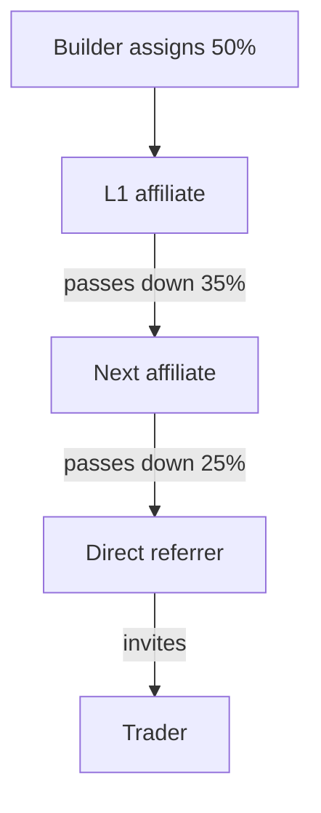

## 1. What the program lets you do

The Orderly DEX Affiliate Program helps you grow your DEX through a multilevel affiliate network. You can:

- Set the commission available to your direct affiliates.
- Let affiliates build their own referral networks, up to 15 affiliate levels.
- Reward both direct and indirect referrals while keeping control of your total commission allocation.

In this guide, a **Level 1 (L1) affiliate** is an affiliate directly connected to your DEX. Affiliates below L1 are managed by the affiliate immediately above them.

## 2. Before you start

Your DEX needs a valid Broker ID before you can enable the program. This applies whether you integrate through APIs, the SDK, or Orderly One.

Manage the program in [Orderly One Affiliate](https://dex.orderly.network/affiliate).

For a comparison with the legacy program and migration guidance, see [Legacy and multilevel affiliate programs](/introduction/be-a-broker/affiliate-referral-program#legacy-and-multilevel-affiliate-programs).

## 3. Set up your program

### 3.1 Choose the commission basis

The commission basis is the amount to which affiliate commission rates are applied.

| Mode                                          | How it works                                                                                                                                                                                                                                                                                                |
| --------------------------------------------- | ----------------------------------------------------------------------------------------------------------------------------------------------------------------------------------------------------------------------------------------------------------------------------------------------------------- |
| **Builder revenue**                           | Applies all affiliate commission rates to builder revenue for each trade. This is the default mode.                                                                                                                                                                                                         |
| **Trading fee with builder revenue fallback** | Applies all affiliate commission rates to the standard gross trading fee. It excludes module fees charged by other builders, custom per-order fees, and any other fees added on top. If the requested commission exceeds builder revenue, the whole calculation switches to builder revenue for that trade. |

**Example:** A trade has a standard trading fee of \$90, builder revenue of \$50, and a total affiliate commission rate of 30%.

| Mode                                          | Basis used | Total affiliate commission | Builder revenue remaining |
| --------------------------------------------- | ---------- | -------------------------- | ------------------------- |
| **Builder revenue**                           | \$50       | \$15                       | \$35                      |
| **Trading fee with builder revenue fallback** | \$90       | \$27                       | \$23                      |

If the total rate were 80%, the trading-fee calculation would request \$72. Because that exceeds the \$50 of builder revenue, the entire calculation would use \$50 instead. Both modes would then produce a \$40 commission.

To change the basis mode, contact Orderly. Once processed, the change takes effect at **00:00 UTC on the next calendar day**. Trades before that time use the previous mode. Settled commissions are not recalculated.

### 3.2 Set your program rates

Configure rates in this order:

1. **Minimum pass-down rate:** The lowest rate that can be assigned within the network. If it is greater than 0, direct referrers are guaranteed at least that rate.
2. **Default bonus rate:** Added to the minimum pass-down rate to determine the total rate for L1 affiliates who do not have a custom rate.
3. **Custom bonus rate:** Replaces the default bonus for a specific L1 affiliate. Their total rate is the minimum pass-down rate plus their custom bonus rate.

Keep these rules in mind:

- An L1 total rate is the minimum pass-down rate plus the applicable bonus rate. It cannot exceed 100%.
- You manage L1 rates only. Each affiliate manages the rates of their own direct referees.
- Increasing the minimum pass-down rate will be rejected if it would make any L1 total rate exceed 100%.

## 4. Understand how affiliates earn

Consider this referral path:

When the trader trades:

- The **direct referrer** earns their full assigned rate of 25%.
- The next affiliate earns the difference between 35% and 25%, which is 10%.
- The L1 affiliate earns the difference between 50% and 35%, which is 15%.

The total distributed rate remains 50%. The trader does not earn affiliate commission from their own trade.

## 5. Change an L1 rate

When you change an L1 affiliate's rate:

- **Increase:** The additional allocation goes to that L1 affiliate. Rates farther down the network do not change.
- **Decrease:** The reduction comes from that L1 affiliate's earnings first. It moves down the network only if the affiliate cannot absorb the full reduction.
- **Historical results:** Settled commissions are never recalculated.
