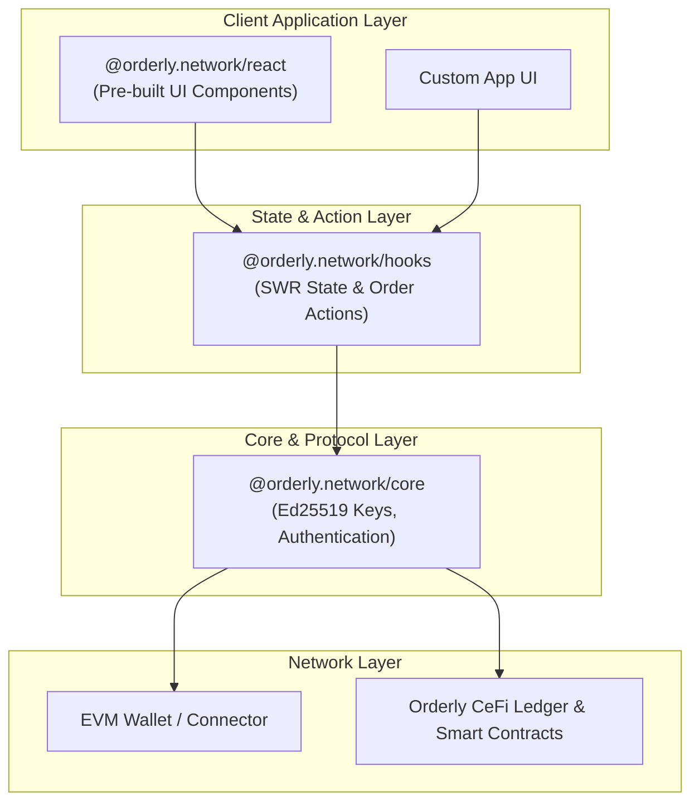

Orderly Network provides a layered SDK architecture to give developers flexibility in integration. Understanding how these layers interact is crucial for building robust applications and preventing state synchronization errors.

---

## 1. SDK Layer Architecture

Orderly's frontend SDK is split into three main packages. Here is the dependency and data flow relationship:



- **`@orderly.network/core` (Core SDK)**: Responsible for account lifecycle, cryptographic key management (Orderly Key), and raw REST/WS communication. It sits directly on top of the EVM wallet connector.
- **`@orderly.network/hooks` (Hooks SDK)**: Exposes reactive state hooks using SWR for balance, orderbooks, and positions, along with action methods for order execution. It is headless (contains no styling).
- **`@orderly.network/react` (React UI SDK)**: Provides high-level, styled components (such as Orderbook, Trading board, Asset management) built on top of the hooks.

---

## 2. Developer Avoidance Checklist (AI & Human)

Ensure your integration follows these rules to avoid broken UI states and transaction failures:

### ⬜ Rule 1: Always wrap your application with the correct Provider

All Hooks and React components require context providers to access the Orderly core instance and wallet connection state.

- **Best Practice**: Wrap your main root element with `<OrderlyConfigProvider>` and `<OrderlyProvider>`.
- **Anti-pattern**: Calling `useOrderbook` or `useAccount` outside or above the `<OrderlyProvider>` component tree.

### ⬜ Rule 2: Ensure correct Wallet-to-SDK connection synchronization

The SDK does not connect to the blockchain network directly; it wraps your wallet provider.

- **Best Practice**: Ensure the wallet's signer is passed to `useAccount().setAddress()` when the wallet connects or switches chains.
- **Anti-pattern**: Assuming the SDK automatically detects wallet changes without updating the core state provider.

### ⬜ Rule 3: Do not nest or declare multiple OrderlyProviders

- **Best Practice**: Maintain a single root `<OrderlyProvider>` for your entire application.
- **Anti-pattern**: Creating multiple providers for different pages or features. This resets the internal WebSocket connections and results in duplicated state synchronization.

---

## 3. Custom UI Hook Integration Example

If you want to build a fully custom interface without using the pre-built React components, you should bypass `@orderly.network/react` and use `@orderly.network/hooks` directly. Here is a clean pattern:

```jsx
import React from "react";
import { OrderlyProvider, OrderlyConfigProvider } from "@orderly.network/react";
import { useOrderbook, useOrderEntry, useAccount } from "@orderly.network/hooks";

// 1. Root configuration wrapper
export function App({ children }) {
  return (
    <OrderlyConfigProvider brokerId="your_broker_id" networkId="testnet">
      <OrderlyProvider>{children}</OrderlyProvider>
    </OrderlyConfigProvider>
  );
}

// 2. Custom Trading Component using Headless Hooks
export function CustomTradingConsole() {
  const { state } = useAccount();
  const [orderbook] = useOrderbook("PERP_ETH_USDC");
  const { onSubmit } = useOrderEntry({
    symbol: "PERP_ETH_USDC",
    side: "BUY",
    order_type: "LIMIT"
  });

  const handlePlaceOrder = async () => {
    try {
      const result = await onSubmit({
        order_price: "3000",
        order_quantity: "0.1"
      });
      console.log("Order submitted successfully:", result);
    } catch (err) {
      console.error("Order submission failed:", err);
    }
  };

  return (
    <div className="trading-console">
      <h3>Account Status: {state.status}</h3>

      <div className="orderbook-preview">
        <h4>Orderbook (Bids)</h4>
        {orderbook.bids?.slice(0, 5).map((bid, i) => (
          <div key={i}>
            {bid.price} - {bid.quantity}
          </div>
        ))}
      </div>

      <button onClick={handlePlaceOrder} disabled={state.status !== "authenticated"}>
        Place Buy Limit Order (0.1 ETH @ 3000)
      </button>
    </div>
  );
}
```
